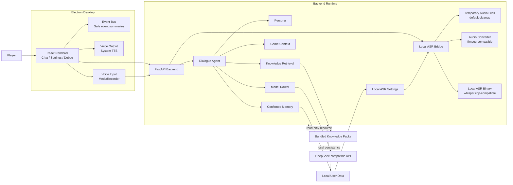
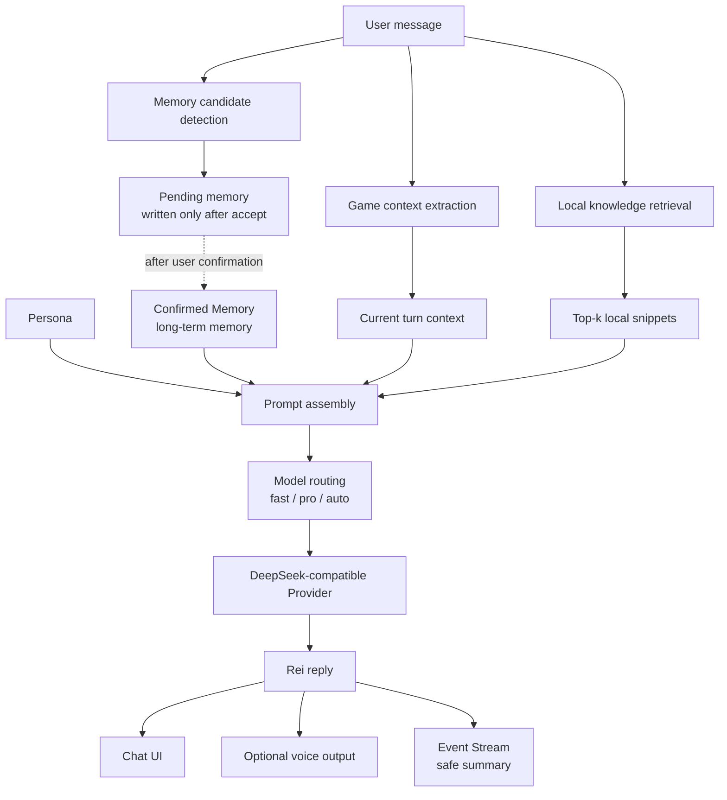
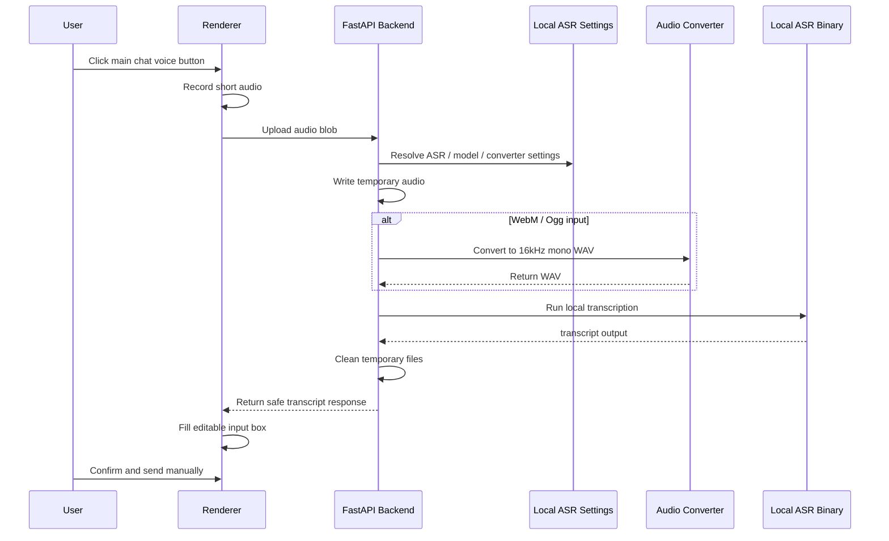

# ReiLink

> A local-first AI game companion desktop runtime.

[简体中文](README.md) | English

[](docs/PROJECT_STATUS.md)
[](#quick-start)
[](https://www.electronjs.org/)
[](https://fastapi.tiangolo.com/)
[](#architecture)
[](LICENSE)

ReiLink is a Chinese-first AI companion runtime for single-player game players. It brings game context, player dialogue, confirmed memory, local knowledge packs, voice input/output, and safe runtime events into one desktop app.

ReiLink is not a generic chatbot and not a guide-site clone. Final replies remain persona + LLM generated; game context, memory, and knowledge retrieval only provide supporting context. The current companion persona is an original Rei-like minimal style and does not use Evangelion, Rei Ayanami, NERV, or any official IP elements.

## Table Of Contents

- [What Is ReiLink?](#what-is-reilink)
- [Current Status](#current-status)
- [Highlights](#highlights)
- [Feature Matrix](#feature-matrix)
- [Architecture](#architecture)
- [Agent Turn Flow](#agent-turn-flow)
- [Voice Interaction MVP](#voice-interaction-mvp)
- [Knowledge Retrieval](#knowledge-retrieval)
- [Local-first And Privacy](#local-first-and-privacy)
- [Quick Start](#quick-start)
- [Local ASR Setup](#local-asr-setup)
- [Packaging](#packaging)
- [Documentation](#documentation)
- [Roadmap](#roadmap)
- [Known Limitations](#known-limitations)
- [License](#license)

## What Is ReiLink?

Most game companions drift toward either generic chat or static guide lookup. ReiLink explores a quieter middle ground:

- the player controls input, sending, and memory writes;
- the companion stays restrained, low-emotion, and low-interruption;
- local knowledge provides factual context only when relevant;
- long-term memory is written only after user confirmation;
- voice input is transcript-first, editable, and manually sent;
- user data, settings, knowledge packs, and audio handling stay local-first.

The project is currently built for local demos, portfolio presentation, code review, and product/runtime iteration. It is not a commercial installer.

## Current Status

- Current development milestone: **Voice Interaction MVP / Local ASR v1 packaged configurable MVP**.
- The `dev/codex-reilink` branch contains the latest Voice, Local ASR, and Knowledge Retrieval work.
- The current development line includes Voice Output, Local ASR voice input, the main chat voice button, persisted Local ASR Settings, Knowledge Retrieval, and QA regression scenarios.
- Public release tags may lag behind the dev branch. GitHub updates, release tags, push, and merge still require manual review.
- The macOS packaged app has been smoke-tested repeatedly, but ReiLink remains pre-release.

See [`docs/PROJECT_STATUS.md`](docs/PROJECT_STATUS.md) for detailed project state.

## Highlights

- Chinese-first AI companion chat with an original minimal persona.
- [DeepSeek](https://api-docs.deepseek.com/) compatible provider and `fast` / `pro` / `auto` model routing.
- Confirmable Memory: long-term memory is written only after user acceptance.
- Game Context: current game, boss, progression, frustration state, and manual current-game override.
- Local sample knowledge packs for [Elden Ring](data/knowledge/games/elden_ring) and [Hollow Knight](data/knowledge/games/hollow_knight).
- Knowledge Retrieval v1: local keyword retrieval, top-k snippets, grounding/gating, explicit game-name switching, and casual-chat isolation.
- Voice Output MVP: optional system TTS with sanitized Event Stream summaries.
- Voice Input MVP: Local ASR through user-configured [whisper.cpp](https://github.com/ggerganov/whisper.cpp) compatible binary, model, and [ffmpeg](https://ffmpeg.org/) compatible converter.
- Event Stream / Debug Panel: safe summaries without raw prompts, API keys, full paths, or full transcripts.
- macOS packaged app runtime foundation: bundled backend binary, bundled knowledge resources, and user data outside the `.app`.

## Feature Matrix

| Area | Capability | Status | Notes |
| --- | --- | --- | --- |
| Persona | Original Rei-like minimal companion | MVP | Original persona, no official IP elements. |
| Dialogue | LLM-first reply generation | Done | Game context / memory / knowledge provide context only. |
| Memory | Pending memory confirmation | Done | Accepted memories only. |
| Game Context | Boss / deaths / frustration / session | MVP | Rule-first with limited LLM semantic fallback. |
| Knowledge Retrieval | Local keyword retrieval | MVP | No embeddings, vector DB, or hybrid retrieval yet. |
| Voice Output | System TTS | MVP | Optional, not character-grade voice acting. |
| Voice Input | Local ASR | MVP | User-managed binary, model, and converter required. |
| Event Stream | Safe lifecycle events | Done | No raw prompt, API key, full path, or full transcript. |
| Packaging | macOS `.app` | MVP | User data stays outside the `.app`; unsigned local build. |
| Overlay | In-game overlay | Planned | Not implemented. |
| Live2D | Avatar layer | Planned | Not implemented. |
| Embedding / Hybrid RAG | Vector / hybrid retrieval | Planned | Current retrieval is keyword-based. |

## Architecture

ReiLink uses an [Electron](https://www.electronjs.org/) desktop shell, a [React](https://react.dev/) / [TypeScript](https://www.typescriptlang.org/) / [Vite](https://vite.dev/) renderer, and a local [FastAPI](https://fastapi.tiangolo.com/) backend. Packaged builds use [PyInstaller](https://pyinstaller.org/) for the backend binary. Diagrams use [Mermaid](https://mermaid.js.org/) and render directly on GitHub.



The renderer owns interaction, audio capture, system TTS, and safe event display. The backend owns the Agent runtime, knowledge retrieval, memory, game context, model routing, Local ASR subprocess boundaries, and user data directories. Local ASR settings are stored in Local User Data. Local ASR uses temporary audio files and cleans them by default after processing. Transcript only fills the input box; it does not automatically enter memory, prompt, knowledge retrieval, or game context.

## Agent Turn Flow

ReiLink does not send user text straight into a generic chatbot. Each turn prepares game context, memory candidates, local knowledge, prompt assembly, model routing, and safe output surfaces.



Prompt assembly includes persona, confirmed memory, current turn context, and relevant knowledge snippets. Memory is not written automatically. Knowledge is injected only when relevant. Casual chat does not force retrieval. Event Stream shows safe summaries only.

## Voice Interaction MVP

Voice Interaction MVP is intentionally conservative: optional voice output, user-triggered voice input, and transcript-first confirmation. It is not a full natural voice assistant.

### Voice Output

- Uses local system `speechSynthesis`.
- Optional and off by default.
- No commercial TTS provider is integrated.
- Supports Test Voice, rate, volume, and Stop Voice.
- Event Stream records safe lifecycle summaries only.
- Known limitation: system voices are not character-grade and may pronounce "Rei" or game terms unnaturally.

### Voice Input / Local ASR

- Web Speech fallback is unreliable in packaged Electron.
- Local ASR is the current stable path.
- Users configure the ASR binary, model, and converter in Settings.
- Transcript fills the input box only, then the user sends manually.
- No cloud ASR upload.
- No audio retention by default.
- No wake word or continuous listening.
- Before confirmation, transcript does not enter memory, prompt, knowledge retrieval, or game context extraction.



Before the user confirms sending, transcript does not enter memory, prompt, knowledge retrieval, or game context extraction.

If ASR is not configured, the converter is not configured, transcription fails, times out, or returns no text, the flow fails safely: it does not auto-send, does not write to memory / prompt / retrieval / game context, and Event Stream / Debug show safe summaries only.

See [`docs/local-asr-manual-setup.md`](docs/local-asr-manual-setup.md) for setup and [`docs/QA.md`](docs/QA.md) for release regression checks.

## Knowledge Retrieval

Current retrieval is local keyword retrieval, not embedding or vector search.

- Supported sample packs: Elden Ring and Hollow Knight.
- Retrieval statuses include `used`, `not_found`, `below_threshold`, `no_pack`, and `not_game_related`.
- Grounding/gating keeps low-relevance snippets out of prompts.
- Casual chat does not force knowledge injection.
- Explicit game names from user messages take priority over current game context.

Knowledge packs live under [`data/knowledge/games`](data/knowledge/games). Authoring guidance is in [`docs/KNOWLEDGE_PACK_AUTHORING.md`](docs/KNOWLEDGE_PACK_AUTHORING.md).

## Local-first And Privacy

Local-first means local user data, memory, settings, knowledge packs, audio handling, and Local ASR are kept on the device. LLM inference can still use a configured provider such as DeepSeek.

- Local memory, session, settings, and logs are written to the user data directory, not packaged app resources.
- Packaged app user data directory: `~/Library/Application Support/ReiLink/data`.
- Local ASR settings example path: `~/Library/Application Support/ReiLink/data/local_asr_settings.json`.
- API keys and local environment files are not bundled into the `.app`.
- Pending memory requires user confirmation.
- Local ASR audio is short-lived temporary data and is cleaned after processing.
- Event Stream / Debug / Raw JSON avoids raw prompts, full transcripts, raw subprocess output, API keys, full local paths, audio content, and base64 audio.

## Quick Start

### 1. Requirements

- macOS for the current packaged app path.
- Python backend environment.
- Node.js / npm desktop environment.
- Optional real LLM provider credentials.
- Optional Local ASR tools: whisper.cpp-compatible binary, compatible model file, and converter.

### 2. Backend / Desktop Dev

```bash
make install-backend
make install-desktop
make doctor
make dev-backend
make dev-desktop
```

`make dev` does not manage long-running processes. Start backend and desktop separately.

### 3. Provider Setup

Configure the LLM provider in the local backend environment. Do not commit real keys or local environment files. `LLM_PROVIDER=mock` can be used for no-key local demos.

Health checks:

```bash
curl http://127.0.0.1:8000/api/health
curl http://127.0.0.1:8000/api/setup/status
```

### 4. Optional Local ASR Setup

Real Local ASR requires user-managed local tools outside the repo and outside the packaged app:

- whisper.cpp-compatible CLI binary
- compatible local model file
- ffmpeg-like converter for browser WebM / Ogg recordings

Then configure the paths from Settings -> Voice Input -> `本地 ASR 配置 / Local ASR Setup`. See [`docs/local-asr-manual-setup.md`](docs/local-asr-manual-setup.md).

### 5. Packaging

```bash
make package-backend
make package-desktop
```

The local unsigned macOS app is generated at `apps/desktop/release/ReiLink-darwin-<arch>/ReiLink.app`.

## Local ASR Setup

Configuration priority:

1. Settings user configuration.
2. Local ASR environment fallback.
3. Unconfigured safe fallback.

The Settings API returns configured booleans, source, and basenames only. Full paths are stored only in local configuration or shown in user-edited inputs. ReiLink does not bundle, auto-fetch, or ship whisper binaries, models, ffmpeg, or third-party executables.

## Packaging

Packaged app backend priority:

1. Healthy external backend on `127.0.0.1:8000`.
2. User-configured backend binary.
3. Bundled backend binary inside the `.app`.
4. Repo-local fallback in development.

Packaged resources are read-only. Memory, session, settings, logs, and Local ASR settings live outside the `.app`. The current macOS app is an unsigned local build without installer, notarization, auto updater, or Windows / Linux packaging.

## Documentation

| Document | Purpose |
| --- | --- |
| [`docs/PROJECT_STATUS.md`](docs/PROJECT_STATUS.md) | Current project state and scope. |
| [`docs/QA.md`](docs/QA.md) | Manual QA and release regression checklist. |
| [`docs/local-asr-manual-setup.md`](docs/local-asr-manual-setup.md) | Real Local ASR setup and smoke flow. |
| [`docs/voice-input-local-asr-spike.md`](docs/voice-input-local-asr-spike.md) | Local ASR design background and implementation notes. |
| [`docs/release-notes/reilink-voice-mvp.md`](docs/release-notes/reilink-voice-mvp.md) | Voice Interaction MVP release notes draft. |
| [`docs/qa/retrieval_scenarios.json`](docs/qa/retrieval_scenarios.json) | Machine-readable Knowledge Retrieval regression scenarios. |
| [`docs/qa/voice_input_scenarios.json`](docs/qa/voice_input_scenarios.json) | Machine-readable Voice Input fallback scenarios. |
| [`docs/qa/voice_input_local_asr_scenarios.json`](docs/qa/voice_input_local_asr_scenarios.json) | Machine-readable Local ASR release regression scenarios. |
| [`docs/TROUBLESHOOTING.md`](docs/TROUBLESHOOTING.md) | Common startup and runtime troubleshooting. |

## Roadmap

### v0.2 Runtime Foundation

The current development line has largely completed this MVP foundation.

- Voice Output MVP.
- Local ASR Voice Input MVP.
- Knowledge Retrieval v1.
- Event Stream / Debug privacy guardrails.
- Packaged app runtime foundation.

### v0.2.x Stabilization

- Local ASR native file picker.
- Local ASR setup helper.
- ASR accuracy / timeout tuning.
- More robust QA regression flows.

### v0.3 Gameplay Presence

- Overlay v1.
- Better gameplay session awareness.
- Low-interruption proactive companion display.

### v0.4 Character Presence

- Live2D avatar layer.
- Character state machine.
- More natural local character TTS exploration.

### Later

- Embedding / hybrid retrieval.
- More games and richer knowledge packs.
- Installer / updater.

## Known Limitations

- Pre-release / portfolio-oriented project.
- macOS-first.
- No installer, code signing, notarization, or auto updater.
- No cloud account or sync.
- No bundled whisper binary, model, ffmpeg, or third-party executable.
- System TTS may sound unnatural and is not character-grade voice acting.
- Local ASR accuracy depends on model size, microphone quality, noise, and hardware.
- No wake word or continuous listening.
- No Overlay yet.
- No Live2D yet.
- No embedding, vector DB, or hybrid retrieval yet.
- Knowledge packs are samples, not complete guide libraries.
- Current packaged app is a local unsigned development build.

## License

MIT License. See [LICENSE](LICENSE).
