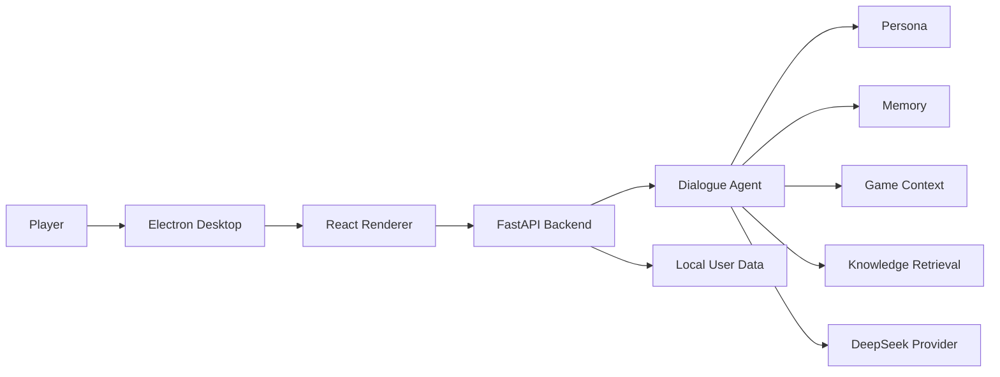
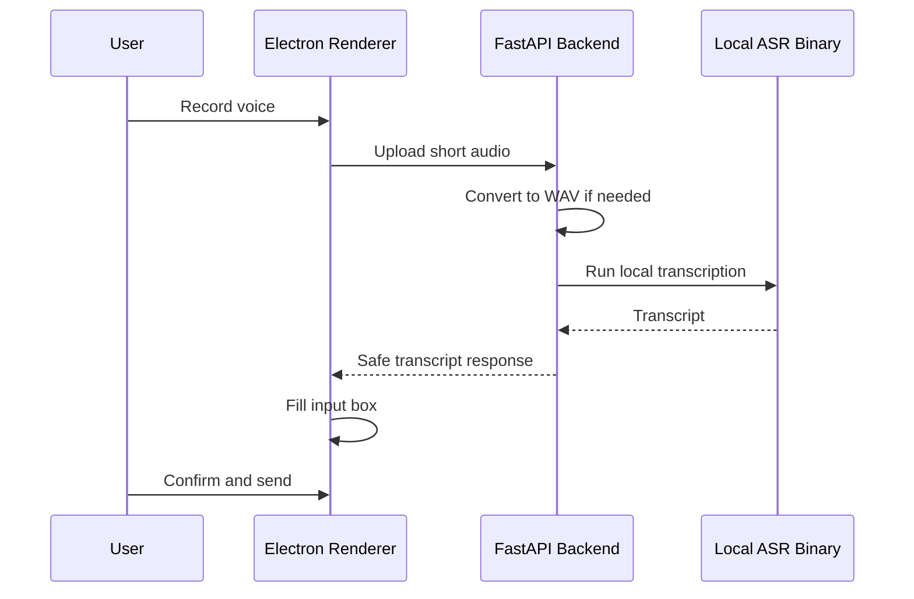

# ReiLink

> Local-first AI game companion runtime for low-interruption, context-aware gameplay support.

[简体中文](README.md) | English

[](docs/PROJECT_STATUS.md)
[](#quick-start)
[](https://www.electronjs.org/)
[](https://fastapi.tiangolo.com/)
[](#architecture)
[](LICENSE)

ReiLink is a Chinese-first desktop AI companion runtime for single-player games. It combines active game state, player dialogue, confirmed memory, local knowledge packs, and low-interruption voice interaction into one local-first application.

ReiLink is not a generic chatbot and not a guide-site clone. Final replies remain LLM-first through persona + model generation; game context, memory, and knowledge retrieval provide supporting context only. The current companion persona is an original Rei-like minimal style and does not use Evangelion, Rei Ayanami, NERV, or any official IP elements.

## Table Of Contents

- [Why ReiLink](#why-reilink)
- [Current Status](#current-status)
- [Highlights](#highlights)
- [Feature Matrix](#feature-matrix)
- [Architecture](#architecture)
- [Voice Interaction MVP](#voice-interaction-mvp)
- [Knowledge Retrieval](#knowledge-retrieval)
- [Privacy & Local-first Design](#privacy--local-first-design)
- [Quick Start](#quick-start)
- [Local ASR Setup](#local-asr-setup)
- [Packaging](#packaging)
- [Documentation](#documentation)
- [Roadmap](#roadmap)
- [Known Limitations](#known-limitations)
- [License](#license)

## Why ReiLink

Most game companions drift into either generic chat or static guide lookup. ReiLink explores a quieter middle ground:

- keep the player in control during gameplay;
- preserve a restrained, low-emotion companion style;
- use factual local knowledge without turning replies into wiki dumps;
- keep memory explicit and confirmable;
- keep voice input transcript-first, editable, and user-confirmed;
- keep sensitive runtime data local.

The project is currently portfolio / pre-release oriented. It is suitable for local demos, code review, and product/runtime iteration, not a commercial installer.

## Current Status

- Current public pre-release line: `reilink-v0.2-pre`.
- Active development branch: `dev/codex-reilink`.
- Voice Interaction MVP is implemented: optional local system TTS, Local ASR main-chat input, transcript-first user confirmation, Local ASR Settings persistence, and release regression coverage.
- Knowledge Retrieval v1 is implemented with local keyword retrieval, grounding / gating, explicit game-name switching, and casual-chat isolation.
- macOS packaged app runtime has been smoke-tested repeatedly, but the project is still pre-release.

See [`docs/PROJECT_STATUS.md`](docs/PROJECT_STATUS.md) for the detailed project state.

## Highlights

- Chinese-first AI companion chat with an original minimal persona.
- [DeepSeek](https://api-docs.deepseek.com/) compatible provider and model routing (`fast` / `pro` / `auto`).
- Confirmable memory: long-term memory is written only after user acceptance.
- Game context and manual current-game override.
- Local knowledge packs for [Elden Ring sample knowledge](data/knowledge/games/elden_ring) and [Hollow Knight sample knowledge](data/knowledge/games/hollow_knight).
- Knowledge Retrieval v1: keyword retrieval, top-k snippets, grounding / gating, and explicit cross-game query isolation.
- Voice Output MVP: optional local system TTS with sanitized lifecycle events.
- Voice Input MVP: Local ASR path with user-configured [whisper.cpp](https://github.com/ggerganov/whisper.cpp) compatible binary, model, and [ffmpeg](https://ffmpeg.org/) style converter.
- Event Stream and Debug Panel with privacy guardrails.
- Standalone macOS app packaging with bundled backend binary and read-only resources.

## Feature Matrix

| Area | Capability | Status | Notes |
| --- | --- | --- | --- |
| Persona / Dialogue | Original Rei-like minimal persona, LLM-first replies | Done | No official IP elements. |
| Model Provider | DeepSeek-compatible provider and model routing | Done | Local config required for real provider use. |
| Memory | Pending memory confirmation | Done | User acceptance required before long-term memory write. |
| Game Context | Session state, local detector, manual override | MVP | Lightweight local detection; manual override remains important. |
| Knowledge Retrieval | Keyword retrieval, grounding / gating, explicit game switching | MVP | Sample packs only, not a complete guide library. |
| Voice Output | Local system TTS, Test Voice, rate / volume, Stop Voice | MVP | System voices are not character-grade voice acting. |
| Voice Input / Local ASR | Main chat Local ASR, transcript cleanup, no auto-send | MVP | Manual setup required; no bundled whisper/model/ffmpeg. |
| Event Stream / Debug | Safe lifecycle summaries and debug surfaces | Done | Avoids raw prompt, API keys, full paths, full transcript. |
| Packaging | macOS local packaged app with bundled backend/resources | MVP | Unsigned local build; no installer/updater yet. |
| Overlay | Gameplay overlay | Planned | Not implemented. |
| Live2D | Avatar layer | Planned | Not implemented. |
| Embedding / Hybrid RAG | Vector or hybrid retrieval | Planned | Current retrieval is keyword-based. |

## Architecture

ReiLink uses an [Electron](https://www.electronjs.org/) desktop shell, a [React](https://react.dev/) / [TypeScript](https://www.typescriptlang.org/) / [Vite](https://vite.dev/) renderer, and a local [FastAPI](https://fastapi.tiangolo.com/) backend. Packaged builds use [PyInstaller](https://pyinstaller.org/) for the backend binary. The diagrams below use [Mermaid](https://mermaid.js.org/) and render directly on GitHub.



The renderer owns UI, push-to-talk interaction, speech synthesis, and local audio capture. The backend owns dialogue orchestration, provider calls, local data, knowledge retrieval, Local ASR subprocess boundaries, and packaged runtime checks.

## Voice Interaction MVP

ReiLink's voice work is deliberately conservative: optional voice output, user-triggered voice input, and transcript-first confirmation. It is not a fully natural voice assistant.

### Voice Output

- Optional and off by default.
- Uses local browser / system `speechSynthesis`.
- No commercial TTS provider is integrated.
- Supports Test Voice, rate, volume, Stop Voice, and cancellation on new messages / disable / unmount.
- Event Stream records sanitized lifecycle summaries only.
- Known limitation: system voices may pronounce names such as "Rei" unnaturally and are not character-grade voice acting.

### Voice Input

- Web Speech remains a fallback, but it is not reliable in packaged Electron.
- Local ASR is the stable path when configured.
- User configures an ASR binary, model, and converter in Settings.
- ReiLink does not bundle or download whisper binaries, models, ffmpeg, or third-party executables.
- Transcript fills the input box only.
- User confirms and sends manually.
- No cloud ASR.
- No wake word or continuous listening.
- No audio retention by default.
- Before confirmation, transcript does not enter memory, prompt preview, knowledge retrieval, semantic extraction, or game context.



See [`docs/local-asr-manual-setup.md`](docs/local-asr-manual-setup.md) for setup and [`docs/QA.md`](docs/QA.md) for release regression checks.

## Knowledge Retrieval

Current retrieval is local keyword retrieval, not embedding/vector search.

- Supported sample packs: Elden Ring and Hollow Knight.
- Retrieval statuses include `used`, `not_found`, `below_threshold`, `no_pack`, and `not_game_related`.
- Grounding / gating keeps low-relevance snippets out of prompts.
- Casual chat does not force knowledge injection.
- Explicit game names from the user take priority over current game context.

Knowledge packs live under [`data/knowledge/games`](data/knowledge/games). Authoring guidance is in [`docs/KNOWLEDGE_PACK_AUTHORING.md`](docs/KNOWLEDGE_PACK_AUTHORING.md).

## Privacy & Local-first Design

- Local memory, session, settings, and logs are written to the user data directory, not the packaged app resources.
- Packaged app user data lives under `~/Library/Application Support/ReiLink/data`.
- API keys and local environment files are not bundled into the app.
- Pending memory requires user confirmation.
- Local ASR audio is short-lived and cleaned after processing.
- Event Stream / Debug / Raw JSON avoid raw prompts, full transcripts, raw subprocess output, API keys, full local paths, audio content, and base64 audio.

## Quick Start

### 1. Requirements

- macOS for the current packaged app path.
- Python backend environment.
- Node.js / npm for the desktop app.
- Optional provider credentials for real LLM replies.
- Optional local ASR tools for voice input: whisper.cpp-compatible binary, model file, and converter.

### 2. Backend / Desktop Dev

```bash
make install-backend
make install-desktop
make doctor
make dev-backend
make dev-desktop
```

`make dev` intentionally does not manage long-running processes; run backend and desktop in separate terminals.

### 3. Provider Setup

Configure your LLM provider in the local backend environment. Do not commit real keys or local environment files. `LLM_PROVIDER=mock` can be used for no-key local demos.

Health checks:

```bash
curl http://127.0.0.1:8000/api/health
curl http://127.0.0.1:8000/api/setup/status
```

### 4. Optional Local ASR Setup

For real Local ASR, prepare user-managed local tools outside the repo and outside the packaged app:

- whisper.cpp-compatible CLI binary
- compatible local model file
- ffmpeg-like converter for browser-recorded WebM/Ogg input

Then configure paths from Settings -> Voice Input -> `本地 ASR 配置 / Local ASR Setup`.

Detailed guide: [`docs/local-asr-manual-setup.md`](docs/local-asr-manual-setup.md).

### 5. Packaging

```bash
make package-backend
make package-desktop
```

The local unsigned macOS app is generated under `apps/desktop/release/ReiLink-darwin-<arch>/ReiLink.app`.

## Local ASR Setup

Local ASR settings are saved under the backend user data directory as:

```text
~/Library/Application Support/ReiLink/data/local_asr_settings.json
```

Configuration priority:

1. Settings user configuration.
2. Local ASR environment fallback.
3. Unconfigured safe fallback.

The settings API returns safe booleans, source, and basenames only; full paths are only stored locally and may appear in user editing inputs.

## Packaging

Packaged app backend priority:

1. Healthy external backend on `127.0.0.1:8000`.
2. Configured backend binary.
3. Bundled backend binary.
4. Repo-local fallback in development.

Packaged resources are read-only. User data, memory, session, settings, and logs stay outside the app bundle. The current macOS app is unsigned and does not include installer, notarization, auto-update, or Windows/Linux packaging.

## Documentation

| Document | Purpose |
| --- | --- |
| [`docs/PROJECT_STATUS.md`](docs/PROJECT_STATUS.md) | Current project state and scope. |
| [`docs/QA.md`](docs/QA.md) | Manual QA and release regression checklist. |
| [`docs/local-asr-manual-setup.md`](docs/local-asr-manual-setup.md) | Real Local ASR setup and smoke flow. |
| [`docs/voice-input-local-asr-spike.md`](docs/voice-input-local-asr-spike.md) | Local ASR design background and implementation notes. |
| [`docs/release-notes/reilink-voice-mvp.md`](docs/release-notes/reilink-voice-mvp.md) | Voice Interaction MVP release notes draft. |
| [`docs/qa/retrieval_scenarios.json`](docs/qa/retrieval_scenarios.json) | Machine-readable Knowledge Retrieval scenarios. |
| [`docs/qa/voice_input_scenarios.json`](docs/qa/voice_input_scenarios.json) | Machine-readable Voice Input fallback scenarios. |
| [`docs/qa/voice_input_local_asr_scenarios.json`](docs/qa/voice_input_local_asr_scenarios.json) | Machine-readable Local ASR release regression scenarios. |
| [`docs/TROUBLESHOOTING.md`](docs/TROUBLESHOOTING.md) | Common startup and runtime troubleshooting. |

## Roadmap

### Completed / MVP

- Voice Output MVP.
- Local ASR Voice Input MVP.
- Knowledge Retrieval v1.
- Event Stream / Debug privacy guardrails.
- Packaged app runtime foundation.

### Near-term

- Native file picker for Local ASR setup.
- Local ASR setup helper.
- ASR accuracy and timeout tuning.
- More robust knowledge packs.
- Overlay v1.

### Later

- Live2D avatar.
- Character-grade local TTS or more natural local voice output.
- Embedding / hybrid retrieval.
- More games and richer knowledge packs.
- Installer / updater work.

## Known Limitations

- Pre-release / portfolio-oriented project.
- macOS-first.
- No installer, code signing, notarization, or auto updater yet.
- No cloud account or sync.
- No bundled whisper binary, model, ffmpeg, or third-party executable.
- System TTS may sound unnatural and is not character voice acting.
- Local ASR accuracy depends on model size, microphone quality, noise, and hardware.
- No wake word or continuous listening.
- No Overlay yet.
- No Live2D yet.
- No embedding/vector database/hybrid retrieval yet.
- Knowledge packs are samples, not complete guide libraries.
- Current packaged app is a local unsigned development build.

## License

MIT License. See [LICENSE](LICENSE).
