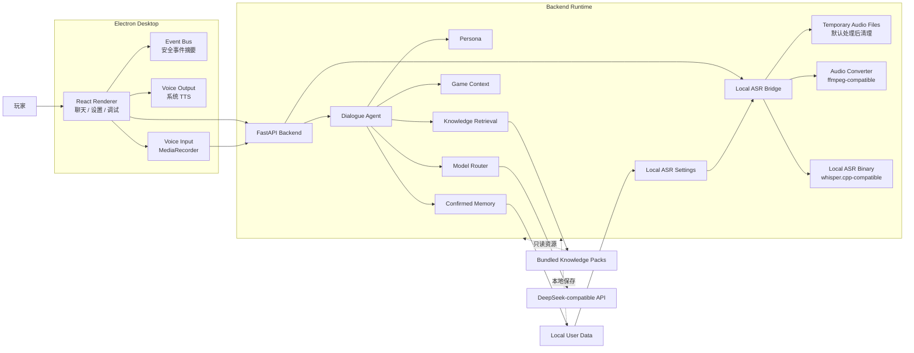
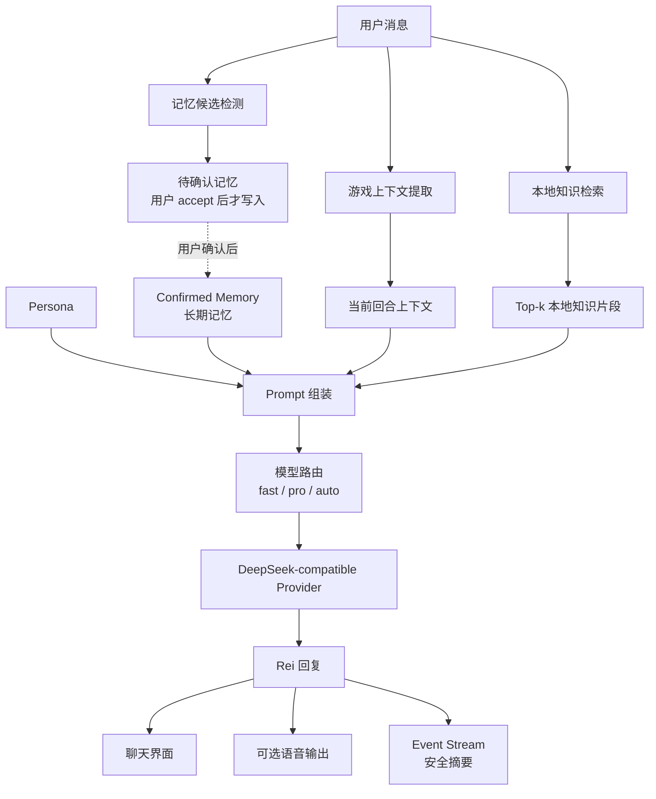
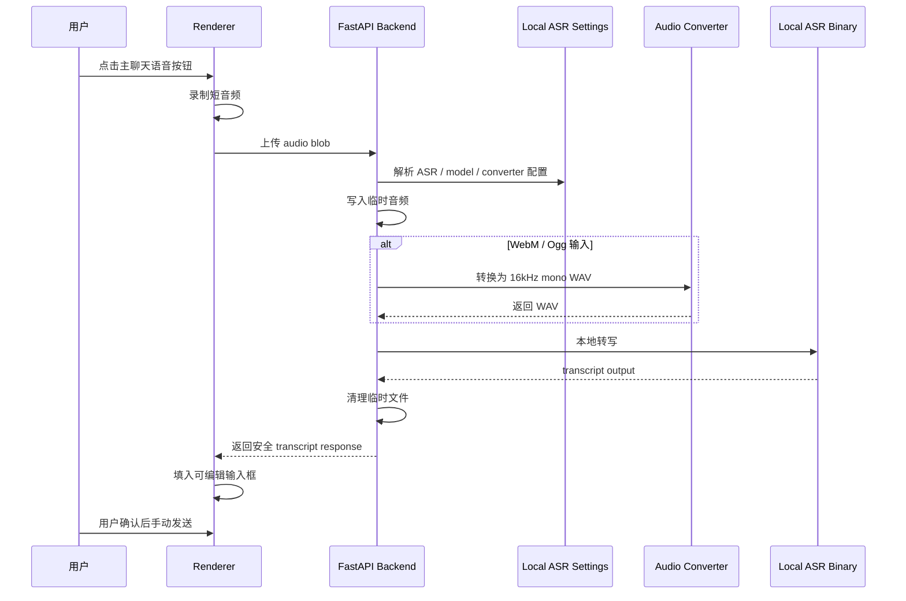

# ReiLink

> 本地优先的 AI 游戏陪伴 Agent 桌面应用。

简体中文 | [English](README.en.md)

[](docs/PROJECT_STATUS.md)
[](#快速开始)
[](https://www.electronjs.org/)
[](https://fastapi.tiangolo.com/)
[](#架构概览)
[](LICENSE)

ReiLink 是面向单机游戏玩家的中文 AI 游戏陪伴运行时。它把当前游戏状态、玩家对话、已确认记忆、本地知识包、语音输入输出和调试事件放在同一个桌面应用里，让 companion 在游戏时提供低打扰、上下文相关、克制的回应。

ReiLink 不是通用 chatbot，也不是攻略站。最终回复仍由 persona + LLM 生成；game context、memory 和 knowledge layer 只提供辅助上下文。当前 companion persona 是原创 Rei-like minimal 风格，不使用 Evangelion、Rei Ayanami、NERV 或任何官方 IP 元素。

## 目录

- [ReiLink 是什么](#reilink-是什么)
- [当前状态](#当前状态)
- [核心亮点](#核心亮点)
- [功能矩阵](#功能矩阵)
- [架构概览](#架构概览)
- [Agent 回答链路](#agent-回答链路)
- [Voice Interaction MVP](#voice-interaction-mvp)
- [Knowledge Retrieval / 本地知识检索](#knowledge-retrieval--本地知识检索)
- [Local-first 与隐私边界](#local-first-与隐私边界)
- [快速开始](#快速开始)
- [Local ASR 配置](#local-asr-配置)
- [打包与运行时说明](#打包与运行时说明)
- [文档入口](#文档入口)
- [路线图](#路线图)
- [已知限制](#已知限制)
- [License](#license)

## ReiLink 是什么

很多游戏 companion 容易落到两个极端：要么只是普通聊天机器人，要么只是静态攻略查询。ReiLink 想探索中间地带：

- 玩家始终掌控输入、发送和记忆写入；
- companion 保持低情绪、低打扰、短句风格；
- 本地知识只在相关时提供事实上下文，不把回复变成 wiki dump；
- 记忆必须经过用户确认；
- 语音输入是 transcript-first，可编辑、可删除、确认后才发送；
- 用户数据、设置、知识包和音频处理尽量保留在本机。

当前项目面向本地演示、作品集展示和 runtime / product iteration，不是正式商业安装包。

## 当前状态

- 当前开发里程碑：**v0.2-pre.4 Context & Memory release hardening**。
- `dev/codex-reilink` 分支包含最新 Voice / Local ASR / Knowledge Retrieval / Context & Memory 进展。
- 当前开发线已完成：Voice Output、Local ASR 语音输入、主聊天语音按钮、Local ASR Settings 持久化、Knowledge Retrieval、Candidate Memory、Memory Retrieval、Session Archive Runtime、Archive Search 与 Archive-to-Memory Candidate Bridge。
- 公开 release tag 可能滞后于当前 dev 分支；GitHub 更新、release tag、push、merge 仍需要人工 review 后进行。
- macOS packaged app 已做多轮 smoke，但项目仍处于 pre-release。

详细状态见 [`docs/PROJECT_STATUS.md`](docs/PROJECT_STATUS.md)。

## 核心亮点

- 中文优先的 AI companion chat，原创 minimal persona。
- [DeepSeek](https://api-docs.deepseek.com/) compatible provider 与 `fast` / `pro` / `auto` 模型路由。
- Confirmable Memory：长期记忆只在用户接受后写入。
- Context & Memory System：Candidate Memory、已确认记忆检索、Persona-Memory Eval、Session Archive safe summaries、Archive Search 和显式 Archive-to-Memory Candidate Bridge。
- Game Context：当前游戏、Boss、进度、挫败状态和手动当前游戏覆盖。
- 本地知识包：包含 [Elden Ring sample knowledge](data/knowledge/games/elden_ring) 与 [Hollow Knight sample knowledge](data/knowledge/games/hollow_knight)。
- Knowledge Retrieval v1：本地 keyword retrieval、top-k snippets、grounding / gating、显式游戏名切换和闲聊隔离。
- Voice Output MVP：系统 TTS，可选开启，安全 Event Stream 生命周期摘要。
- Voice Input MVP：用户配置 [whisper.cpp](https://github.com/ggerganov/whisper.cpp) compatible binary、model 和 [ffmpeg](https://ffmpeg.org/) compatible converter 后走 Local ASR。
- Event Stream / Debug Panel：展示安全摘要，不展示 raw prompt、API key、完整路径或完整 transcript。
- macOS packaged app runtime foundation：bundled backend binary、bundled knowledge resources、用户数据写到 app 外部。

## 功能矩阵

| 范围 | 能力 | 状态 | 说明 |
| --- | --- | --- | --- |
| Persona | 原创 minimal companion | MVP | 原创 Rei-like persona，不使用官方 IP。 |
| Dialogue | LLM-first 回复生成 | 已完成 | Game context / memory / knowledge 只提供上下文。 |
| Memory | Candidate / Retrieval / Archive | 已完成 | 只有 accepted / active 长期记忆会进入 prompt；archive 不直接进入 prompt。 |
| Game Context | Boss / deaths / frustration / session | MVP | Rule-first，必要时结合 LLM semantic fallback。 |
| Knowledge Retrieval | 本地 keyword retrieval | MVP | 暂无 embeddings / vector DB / hybrid retrieval。 |
| Session Archive | 最近会话 safe summary | MVP | 手动归档、搜索、删除、清空和显式候选扫描；不保存 raw prompt / transcript。 |
| Voice Output | 系统 TTS | MVP | 可选开启，不是角色级配音。 |
| Voice Input | Local ASR | MVP | 需要用户手动配置 binary / model / converter。 |
| Event Stream | 安全生命周期事件 | 已完成 | 不显示 raw prompt、API key、完整路径、完整 transcript。 |
| Packaging | macOS `.app` | MVP | 用户数据写在 `.app` 外部；当前为未签名本地构建。 |
| Overlay | macOS safe mode | MVP / 冻结 | Foundation 已有；auto-show 故意 fail-closed。 |
| Live2D | Avatar layer | 计划中 | 尚未实现。 |
| Embedding / Hybrid RAG | Vector / hybrid retrieval | 计划中 | 当前 retrieval 是 keyword-based。 |

## 架构概览

ReiLink 使用 [Electron](https://www.electronjs.org/) desktop shell、[React](https://react.dev/) / [TypeScript](https://www.typescriptlang.org/) / [Vite](https://vite.dev/) renderer，以及本地 [FastAPI](https://fastapi.tiangolo.com/) backend。packaged app 通过 [PyInstaller](https://pyinstaller.org/) 打包 backend binary。下方图表使用 [Mermaid](https://mermaid.js.org/)，可在 GitHub README 直接渲染。



Renderer 负责用户交互、语音录制、系统 TTS 和安全事件展示。Backend 负责 Agent runtime、knowledge retrieval、memory、game context、model routing、Local ASR subprocess 边界和用户数据目录。Local ASR settings 保存在 Local User Data 中；Local ASR 使用短时 temporary audio files，默认处理后清理。transcript 只回填输入框，不会自动进入 memory、prompt、knowledge retrieval 或 game context。Local-first 指本地用户数据、本地记忆、本地设置、本地知识包、音频处理和 Local ASR 优先保存在本机；LLM 推理目前仍可通过用户配置的 DeepSeek-compatible provider 完成。

## Agent 回答链路

ReiLink 的一次回复不是“用户消息直接丢给 chatbot”。它会先整理游戏上下文、记忆候选、本地知识和模型路由，再组装 prompt。



Prompt 会同时使用 persona、confirmed memory、当前回合上下文和相关 knowledge snippets。Memory 不会自动写入；knowledge 只有相关时注入；闲聊不会强行触发 retrieval；Event Stream 只展示安全摘要。

## Voice Interaction MVP

ReiLink 的 Voice Interaction MVP 是保守路线：可选语音输出、用户触发语音输入、transcript-first 确认发送。它不是完整自然语音助手。

### Voice Output

- 使用本机系统 `speechSynthesis`。
- 可选开启，默认关闭。
- 不接商业 TTS provider。
- 支持 Test Voice、rate、volume、Stop Voice。
- Event Stream 只记录安全生命周期摘要。
- 已知限制：声音不够角色化，可能念错 Rei 或游戏专有名词。

### Voice Input / Local ASR

- Web Speech fallback 在 Electron packaged app 中不可靠。
- Local ASR 是当前稳定主路径。
- 用户在 Settings 配置 ASR binary、model 和 converter。
- transcript 只填入输入框，用户确认后才发送。
- 不上传音频到云 ASR。
- 默认不保存音频。
- 不做 wake word / continuous listening。
- 未确认 transcript 不进入 memory、prompt、knowledge retrieval 或 game context extraction。



在用户确认发送前，transcript 不会进入 memory、prompt、knowledge retrieval 或 game context extraction。

如果 ASR 未配置、converter 未配置、转写失败、超时或没有文本，流程会安全失败：不会自动发送，不会写入 memory / prompt / retrieval / game context，Event Stream / Debug 只显示安全摘要。

详细配置见 [`docs/local-asr-manual-setup.md`](docs/local-asr-manual-setup.md)，发布回归见 [`docs/QA.md`](docs/QA.md)。

## Knowledge Retrieval / 本地知识检索

当前 retrieval 是本地 keyword retrieval，不是 embedding / vector search。

- 支持 sample packs：Elden Ring / 艾尔登法环、Hollow Knight / 空洞骑士。
- 状态包括 `used`、`not_found`、`below_threshold`、`no_pack`、`not_game_related`。
- grounding / gating 会阻止低相关知识注入 prompt。
- 闲聊不会强行注入 knowledge。
- 用户显式游戏名优先于 current game context。

知识包位于 [`data/knowledge/games`](data/knowledge/games)，新增知识包规范见 [`docs/KNOWLEDGE_PACK_AUTHORING.md`](docs/KNOWLEDGE_PACK_AUTHORING.md)。

## Local-first 与隐私边界

- 本地 memory、session、settings、logs 写入用户数据目录，不写入 packaged app resources。
- packaged app 用户数据目录：`~/Library/Application Support/ReiLink/data`。
- Local ASR settings 示例路径：`~/Library/Application Support/ReiLink/data/local_asr_settings.json`。
- API keys 和本地环境文件不会打包进 `.app`。
- Pending memory 必须由用户确认。
- Session Archive 只保存 safe summaries；Archive Search 不进 prompt，Archive-to-Memory Bridge 只创建待确认候选。
- Local ASR 音频是短时临时文件，处理后清理。
- Event Stream / Debug / Raw JSON 不展示 raw prompt、完整 transcript、raw subprocess output、API key、完整本地路径、audio content 或 base64 audio。
- Local-first 指本地数据、本地设置、本地知识包和本地 ASR 优先留在本机；不代表当前所有 LLM 推理都离线。

## 快速开始

### 1. 环境要求

- macOS：当前 packaged app 路径以 macOS 为主。
- Python backend 环境。
- Node.js / npm desktop 环境。
- 可选：真实 LLM provider 凭据。
- 可选：Local ASR 所需 whisper.cpp-compatible binary、model file、converter。

### 2. Backend / Desktop 开发模式

```bash
make install-backend
make install-desktop
make doctor
make dev-backend
make dev-desktop
```

`make dev` 不管理长进程；请分别启动 backend 和 desktop。

### 3. Provider 配置

在本地 backend 环境配置 LLM provider。不要提交真实 key 或本地环境文件。无 key 本地演示可使用 `LLM_PROVIDER=mock`。

健康检查：

```bash
curl http://127.0.0.1:8000/api/health
curl http://127.0.0.1:8000/api/setup/status
```

### 4. 可选 Local ASR 配置

真实 Local ASR 需要用户自行准备本地工具，并放在 repo 和 packaged app 外部：

- whisper.cpp-compatible CLI binary
- compatible local model file
- 用于 browser WebM / Ogg 录音的 ffmpeg-like converter

然后在 Settings -> Voice Input -> `本地 ASR 配置 / Local ASR Setup` 中填入路径。详细步骤见 [`docs/local-asr-manual-setup.md`](docs/local-asr-manual-setup.md)。

### 5. 打包

```bash
make package-backend
make package-desktop
```

本地未签名 macOS app 会生成在 `apps/desktop/release/ReiLink-darwin-<arch>/ReiLink.app`。

## Local ASR 配置

配置优先级：

1. Settings 用户配置。
2. Local ASR 环境变量 fallback。
3. 未配置安全 fallback。

Settings API 只返回 configured booleans、source 和 basename；完整路径只保存在本地配置文件中，或出现在用户主动编辑的输入框中。ReiLink 不内置、不自动获取，也不会随项目提供 whisper binary、model、ffmpeg 或第三方可执行文件。

## 打包与运行时说明

packaged app backend 优先级：

1. `127.0.0.1:8000` 上健康的外部 backend。
2. 用户配置的 backend binary。
3. `.app` 内 bundled backend binary。
4. dev 模式下 repo-local fallback。

packaged resources 是只读资源。memory、session、settings、logs 和 Local ASR settings 都保存在 `.app` 外部。当前 macOS app 是本地未签名构建，不包含 installer、notarization、auto updater 或 Windows / Linux 打包。

## 文档入口

| 文档 | 用途 |
| --- | --- |
| [`docs/PROJECT_STATUS.md`](docs/PROJECT_STATUS.md) | 当前项目状态与范围。 |
| [`docs/QA.md`](docs/QA.md) | 手动 QA 与 release regression checklist。 |
| [`docs/release_context_memory_hardening_checklist.md`](docs/release_context_memory_hardening_checklist.md) | Context & Memory release hardening checklist。 |
| [`docs/releases/reilink-v0.2-pre.4-context-memory.md`](docs/releases/reilink-v0.2-pre.4-context-memory.md) | Context & Memory v0.2-pre.4 release notes 草稿。 |
| [`docs/memory_architecture_v0.md`](docs/memory_architecture_v0.md) | Memory 分层、Candidate Memory、Retrieval 和 archive bridge 边界。 |
| [`docs/session_archive_v1_architecture.md`](docs/session_archive_v1_architecture.md) | Session Archive / Search / Archive-to-Memory Bridge 架构。 |
| [`docs/local-asr-manual-setup.md`](docs/local-asr-manual-setup.md) | 真实 Local ASR 配置与 smoke flow。 |
| [`docs/voice-input-local-asr-spike.md`](docs/voice-input-local-asr-spike.md) | Local ASR 设计背景与实现说明。 |
| [`docs/release-notes/reilink-voice-mvp.md`](docs/release-notes/reilink-voice-mvp.md) | Voice Interaction MVP release notes 草稿。 |
| [`docs/qa/retrieval_scenarios.json`](docs/qa/retrieval_scenarios.json) | Knowledge Retrieval 机器可读回归场景。 |
| [`docs/qa/voice_input_scenarios.json`](docs/qa/voice_input_scenarios.json) | Voice Input fallback 机器可读回归场景。 |
| [`docs/qa/voice_input_local_asr_scenarios.json`](docs/qa/voice_input_local_asr_scenarios.json) | Local ASR release regression 场景。 |
| [`docs/TROUBLESHOOTING.md`](docs/TROUBLESHOOTING.md) | 常见启动和运行问题。 |

## 路线图

### v0.2 Runtime Foundation

当前开发线已基本完成该阶段的 MVP 能力。

- Voice Output MVP。
- Local ASR Voice Input MVP。
- Knowledge Retrieval v1。
- Candidate Memory v1 / Memory Retrieval v1。
- Session Archive Runtime / Search / Archive-to-Memory Candidate Bridge。
- Event Stream / Debug privacy guardrails。
- Packaged app runtime foundation。

### v0.2.x Stabilization

- Context & Memory release hardening。
- Packaged app smoke coverage for user-visible runtime changes。
- Local ASR setup helper and accuracy / timeout tuning。
- More robust QA regression flows。

### v0.3 Gameplay Presence

- Overlay v1。
- 更好的游戏会话感知。
- 低打扰 proactive companion display。

### v0.4 Character Presence

- Live2D avatar layer。
- Character state machine。
- 更自然的本地角色 TTS 探索。

### Later

- Embedding / hybrid retrieval。
- More games and richer knowledge packs。
- Installer / updater。

## 已知限制

- Pre-release / portfolio-oriented project。
- macOS-first。
- 还没有 installer、code signing、notarization 或 auto updater。
- 没有 cloud account / sync。
- 不内置 whisper binary、model、ffmpeg 或第三方可执行文件。
- 系统 TTS 可能不够自然，也不是角色级配音。
- Local ASR 准确率取决于模型大小、麦克风、环境噪音和硬件性能。
- 不做 wake word / continuous listening。
- Overlay auto-show 仍处于 macOS fail-closed safe mode。
- 还没有 Live2D。
- 还没有 embedding / vector DB / hybrid retrieval、semantic archive search、prompt archive retrieval 或外部 memory provider。
- 知识包仍是 samples，不是完整攻略库。
- 当前 packaged app 是本地未签名开发构建。

## License

MIT License. See [LICENSE](LICENSE).
