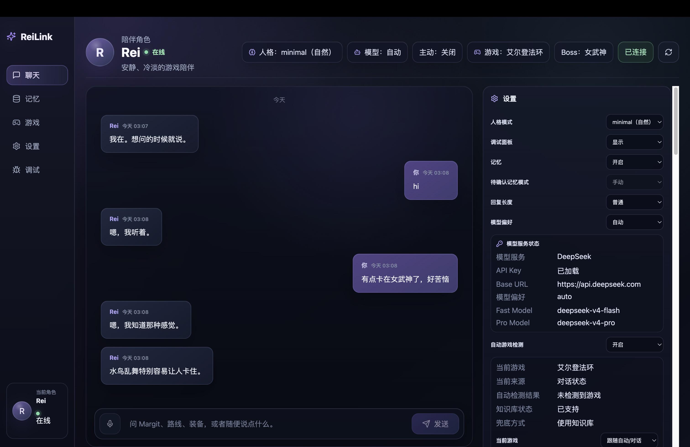
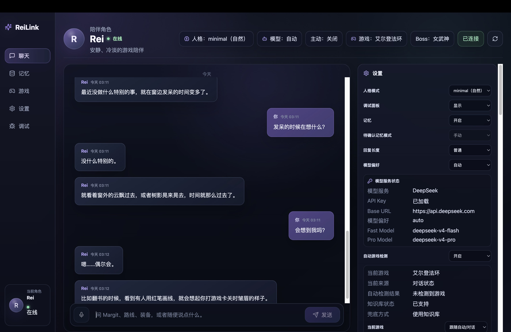
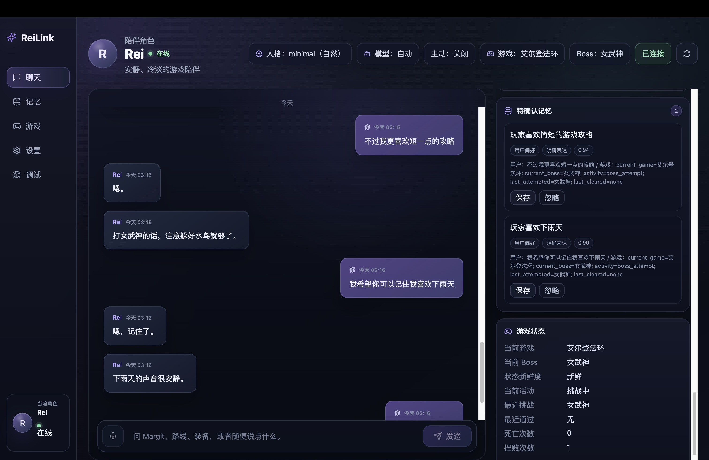
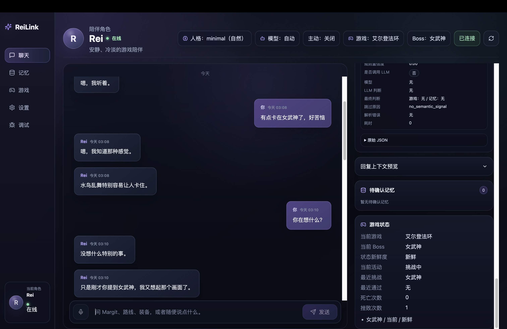
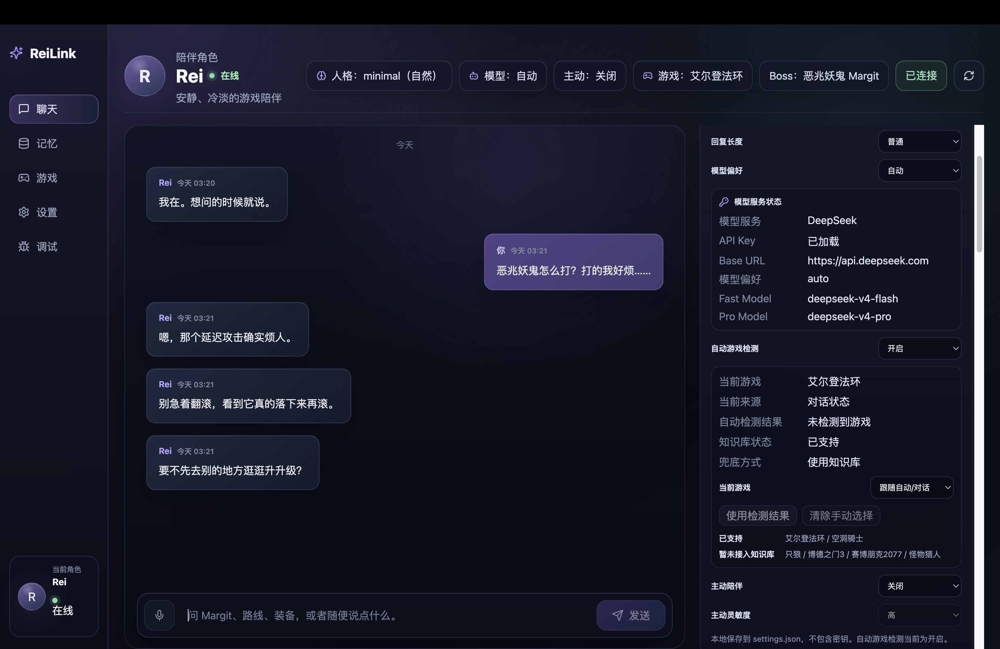
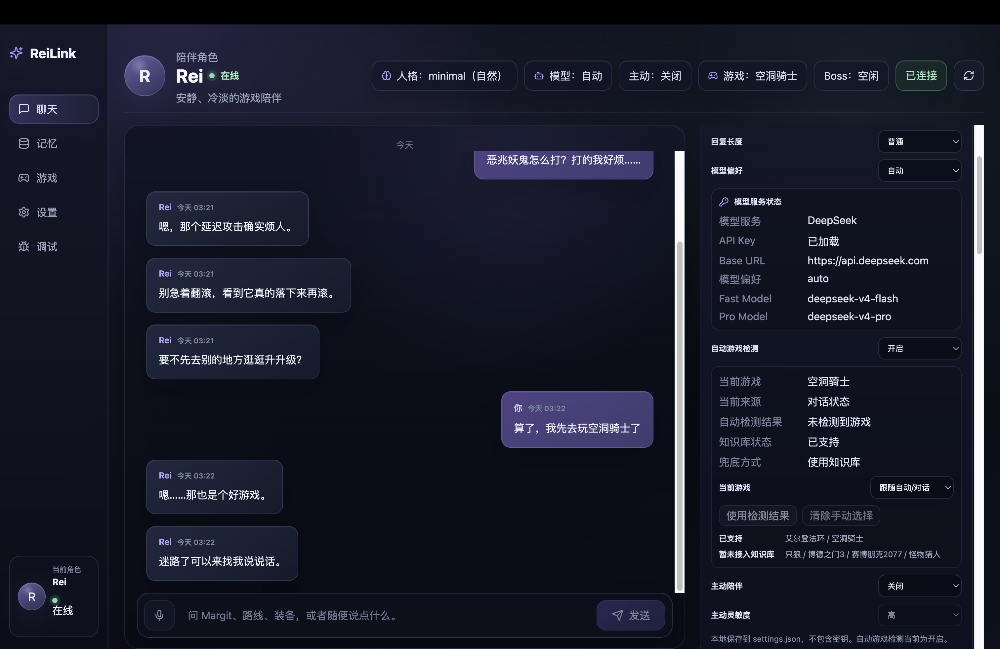
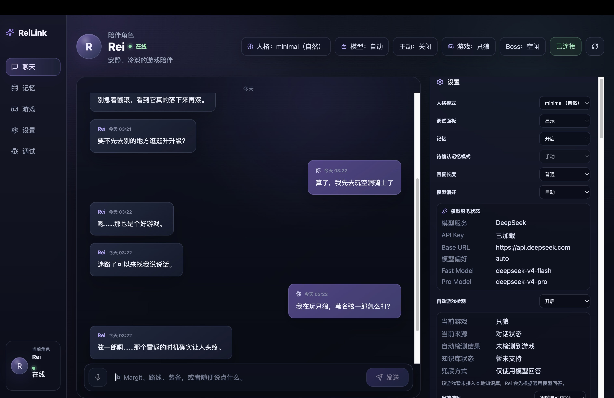
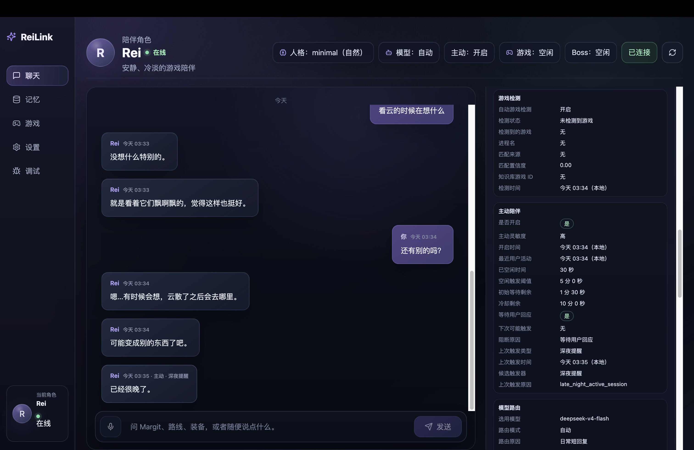
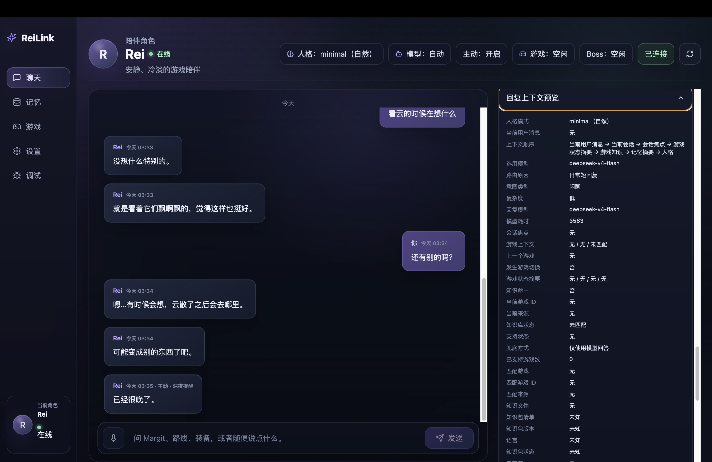
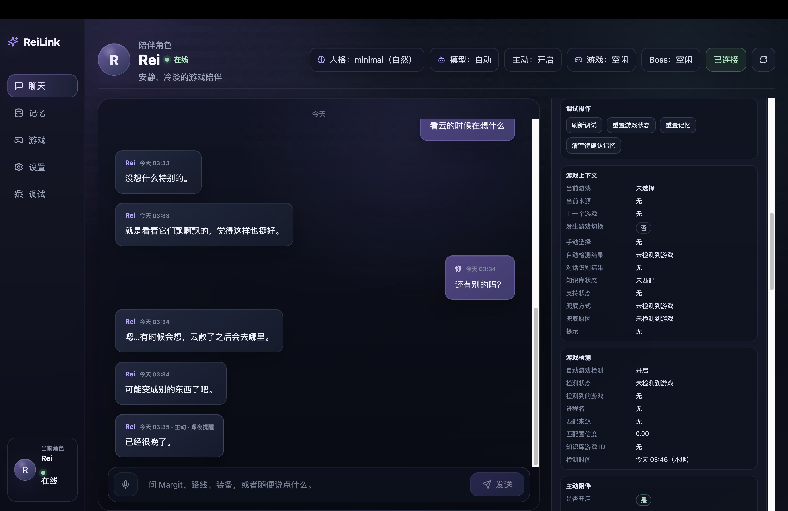

# ReiLink

## 中文

### 项目简介

ReiLink 是一个面向单机游戏玩家的中文 AI Companion 桌面应用。它会结合当前游戏、玩家对话、临时游戏状态、已确认记忆偏好和本地知识包，让一个 Rei-like 的原创低情绪陪伴角色用克制、简短的中文与玩家互动。

ReiLink 不是通用 chatbot，也不是纯攻略站。它更接近一个带有游戏上下文的陪伴层：由 AI companion、game context（游戏上下文）、memory（记忆）和 knowledge layer（知识层）共同组成，但最终回复仍保持 LLM-first，由 persona 与模型生成。

声明：本项目不使用 Evangelion、Rei Ayanami、NERV 或任何官方 IP 元素。

### 状态

Status: MVP / Pre-release。

当前版本适合本地演示、作品集展示和代码审阅。它不是完整商业发布版本，也不包含安装器、云端账号、支付系统或复杂部署流程。

Rei 是原创 companion persona。项目不隶属于 Evangelion、FromSoftware、Team Cherry 或相关权利方。Elden Ring / Hollow Knight 仅作为本地 sample knowledge context 展示多游戏知识接口；相关名称与商标归各自权利方所有。

### 截图展示 / Screenshots

#### 主聊天界面 / Main Companion Chat





#### 可确认记忆 / Confirmable Memory



#### 游戏状态 / Game Session State



#### 多游戏知识库 / Multi-game Knowledge





#### 未支持游戏兜底 / Unsupported Game Fallback



#### 主动陪伴 / Proactive Companion



#### 回复上下文与调试 / Context Preview and Debug





### 功能介绍

- 中文 AI companion chat（中文陪伴聊天）
- Rei-like original minimal persona（原创 minimal 人格）
- DeepSeek provider（DeepSeek 模型提供方）
- Model routing（模型路由）：`fast` / `pro` / `auto`
- Multi-part replies（分段回复）
- Pending memory confirmation（待确认记忆）
- Game session state（游戏会话状态）
- Semantic extraction（语义识别）
- Proactive companion trigger（低频主动陪伴触发）
- Local game detection（本地游戏检测）
- Manual game context override（手动当前游戏覆盖）
- Multi-game knowledge catalog（多游戏知识目录）
- Knowledge pack manifest（知识包清单）
- Elden Ring 与 Hollow Knight sample knowledge packs（样例知识包）
- Debug dashboard（调试面板）
- Prompt / context preview（回复上下文预览）
- Settings panel（设置面板）
- Local-first memory and session state（本地优先的记忆与会话状态）

### 技术栈

Backend:

- Python
- FastAPI
- JSON / JSONL local state
- DeepSeek-compatible provider

Desktop:

- Electron
- React
- TypeScript
- Vite

Tests:

- pytest
- Vitest
- React Testing Library
- Playwright

### 架构概览

主要 backend 模块：

- `persona_engine`：加载 persona 配置并构建系统提示。
- `dialogue_agent`：编排设置、游戏状态、知识、模型路由、provider 调用和 debug 数据。
- `game_session`：维护当前游戏、Boss、进度和临时状态。
- `memory`：维护待确认记忆和已接受长期记忆。
- `semantic_extraction`：从用户消息中识别游戏状态和记忆候选。
- `game_knowledge` / `knowledge`：基于 catalog 与 snippets 提供事实上下文。
- `game_detector`：本地进程 / 应用名检测当前游戏。
- `proactive`：低频主动陪伴触发与冷却控制。
- `app_settings`：持久化用户设置。

主要 desktop 区域：

- Chat UI（聊天）
- Settings（设置）
- Pending Memory（待确认记忆）
- Game Session / Game Context Debug（游戏状态与上下文）
- Prompt Preview（回复上下文预览）
- Knowledge Debug（知识层调试）

### 快速启动 / Quick Start

Makefile 已提供常用命令。

1. 创建 backend 虚拟环境并安装依赖：

```bash
make install-backend
```

2. 安装 desktop 依赖：

```bash
make install-desktop
```

3. 配置 backend 环境变量，手动创建 `services/backend/.env`，不要提交真实 key。可先参考下方“环境变量”。

4. 运行本地环境检查：

```bash
make doctor
```

5. 启动 backend：

```bash
make dev-backend
```

6. 启动 desktop / Electron dev：

```bash
make dev-desktop
```

如果只想启动 Vite renderer：

```bash
cd apps/desktop
npm run dev
```

`make dev` 不做复杂进程管理，只会提示分别运行 `make dev-backend` 和 `make dev-desktop`。

7. 后端健康检查：

```bash
curl http://127.0.0.1:8000/api/health
curl http://127.0.0.1:8000/api/setup/status
```

### 常用命令 / Common Commands

```bash
make doctor
make dev-backend
make dev-desktop
make test-backend
make test-desktop
make test
make lint
make typecheck
```

说明：

- `make doctor`：检查本地环境，不启动长进程。
- `make dev-backend`：启动 FastAPI backend。
- `make dev-desktop`：启动 Electron dev shell。
- `make test`：运行 backend + desktop tests。
- `make lint`：运行 desktop lint 和 `git diff --check`。
- `make typecheck`：当前等同于 desktop build。

常见启动问题见 [docs/TROUBLESHOOTING.md](docs/TROUBLESHOOTING.md)。

### 环境变量

示例配置，放在 `services/backend/.env`：

```bash
LLM_PROVIDER=deepseek
DEEPSEEK_API_KEY=
DEEPSEEK_BASE_URL=https://api.deepseek.com
DEEPSEEK_MODEL_FAST=
DEEPSEEK_MODEL_PRO=
MODEL_PREFERENCE=auto
PERSONA_MODE=minimal
PROACTIVE_COMPANION=off
PROACTIVE_SENSITIVITY=low
AUTO_GAME_DETECTION=on
```

不要在仓库中提交真实 API key。`LLM_PROVIDER=mock` 可用于无 key 的本地演示。

### 首次启动 / 模型配置

第一次启动时，desktop 会读取 backend setup status。如果 DeepSeek API Key 未加载，聊天区会显示“需要完成模型配置”，设置中只显示 API Key 状态，不显示真实 key。

确认 setup status：

```bash
curl http://127.0.0.1:8000/api/setup/status
```

正常配置后应看到：

```json
{
  "provider": "deepseek",
  "provider_configured": true,
  "api_key_loaded": true,
  "needs_setup": false,
  "missing_items": []
}
```

如果 `DEEPSEEK_API_KEY` 缺失，`needs_setup` 会是 `true`，`missing_items` 会包含 `DEEPSEEK_API_KEY`。响应不会返回真实 API key。

### 隐私与本地数据

- `.env`、`*.env` 和 `services/backend/.env` 不应提交。
- `data/memory/*` 保存本地长期记忆数据，不应提交。
- `data/session/*` 保存本地临时会话状态，不应提交。
- Pending memory（待确认记忆）必须由用户接受后才会进入长期记忆。
- Pending memory 不会直接注入 prompt。
- ReiLink 不会自动上传用户记忆或会话状态。
- 本地 knowledge packs 只提供事实上下文，不直接生成 Rei 的最终回复。

### License

ReiLink 使用 MIT License，见 [LICENSE](LICENSE)。

### 知识包结构

知识层使用本地 JSON 文件，不使用外部抓取、Steam API、RAG 或 vector database。

关键路径：

- `data/knowledge/games/catalog.json`：游戏目录。`game_id` 表示游戏 ID，`display_name` 表示显示名称，`support_status` 表示支持状态。
- `data/knowledge/games/{game_id}/manifest.json`：知识包清单。`version` 表示版本，`language` 表示语言，`coverage` 表示覆盖范围。
- `data/knowledge/games/{game_id}/snippets.json`：简短事实片段。

新增游戏知识包见 [`docs/KNOWLEDGE_PACK_AUTHORING.md`](docs/KNOWLEDGE_PACK_AUTHORING.md)。

本地校验：

```bash
make validate-knowledge
```

该命令会检查 catalog、supported 游戏的 manifest 与 snippets 结构。`planned` / `detected_only` 游戏暂未接入知识包时只会输出 warning，不会让校验失败。

当前 sample packs：

- Elden Ring / 艾尔登法环
- Hollow Knight / 空洞骑士

知识层只提供 factual context（事实上下文）。Rei 的最终表达仍由 persona + LLM 生成，避免变成攻略站。

### 当前限制

- 目前只有 Elden Ring 与 Hollow Knight 的样例知识包，不是完整攻略库。
- Game detector 仍是轻量本地进程 / 应用名检测。
- 没有 Live2D / Voice / Vision / Overlay。
- 没有完整 RAG、embedding 或 vector database。
- 多游戏知识库仍处于样例阶段。
- “这个 / 那个 / 刚才说的游戏”这类指代表达仍有已知限制，未来需要 Recent Entity Tracker 或 LLM semantic resolver。

### Roadmap（路线图）

- RAG / vector search
- Steam library integration
- Voice interaction
- Live2D / overlay
- Multi-companion system
- Richer game knowledge packs
- Better entity resolution

## English

### Project Overview

ReiLink is a Chinese-first desktop AI companion for single-player game players. It combines the active game, user conversation, temporary game state, accepted memory preferences, and local knowledge packs so an original Rei-like minimal companion can respond in restrained, concise Chinese.

It is not a generic chatbot and not a pure guide site. ReiLink is designed as an AI companion with game context, memory, and a factual knowledge layer. Final replies remain LLM-first and are generated through the persona and model.

This project does not use Evangelion, Rei Ayanami, NERV, or any official IP elements.

### Status

Status: MVP / Pre-release.

The current version is suitable for local demos, portfolio presentation, and code review. It is not a full commercial release and does not include an installer, cloud accounts, payments, or complex deployment flows.

Rei is an original companion persona. This project is not affiliated with Evangelion, FromSoftware, Team Cherry, or their rights holders. Elden Ring / Hollow Knight are used only as local sample knowledge contexts to demonstrate the multi-game knowledge interface; related names and trademarks belong to their respective owners.

### Screenshots

The bilingual screenshot showcase above uses repository assets under `docs/assets/` for GitHub, portfolio, and interview presentation.

### Key Features

- Chinese AI companion chat
- Original Rei-like minimal persona
- DeepSeek model provider
- Model routing: `fast` / `pro` / `auto`
- Multi-part replies
- Pending memory confirmation
- Game session state
- Semantic extraction
- Proactive companion trigger
- Local game detection
- Manual game context override
- Multi-game knowledge catalog
- Knowledge pack manifest
- Elden Ring and Hollow Knight sample knowledge packs
- Debug dashboard
- Prompt / context preview
- Settings panel
- Local-first memory and session state

### Tech Stack

Backend:

- Python
- FastAPI
- JSON / JSONL local state
- DeepSeek-compatible provider

Desktop:

- Electron
- React
- TypeScript
- Vite

Tests:

- pytest
- Vitest
- React Testing Library
- Playwright

### Architecture

Main backend modules:

- `persona_engine`: loads persona configuration and builds system prompt context.
- `dialogue_agent`: orchestrates settings, game state, knowledge, model routing, provider calls, and debug data.
- `game_session`: tracks active game, boss, progress, and temporary session state.
- `memory`: separates pending memory from accepted long-term memory.
- `semantic_extraction`: extracts game-state and memory-candidate signals from user messages.
- `game_knowledge` / `knowledge`: provides factual context through catalog and snippets.
- `game_detector`: detects the active game from local process or app names.
- `proactive`: handles low-frequency proactive companion triggers and cooldowns.
- `app_settings`: persists user-facing settings.

Main desktop areas:

- Chat UI
- Settings
- Pending Memory
- Game Session / Game Context Debug
- Prompt Preview
- Knowledge Debug

### Quick Start

The Makefile includes the common development commands.

1. Create the backend virtual environment and install dependencies:

```bash
make install-backend
```

2. Install desktop dependencies:

```bash
make install-desktop
```

3. Configure backend environment variables by creating `services/backend/.env` manually. Do not commit real keys. See "Environment Variables" below.

4. Run the local environment check:

```bash
make doctor
```

5. Start the backend:

```bash
make dev-backend
```

6. Start the desktop / Electron dev shell:

```bash
make dev-desktop
```

To start the Vite renderer only:

```bash
cd apps/desktop
npm run dev
```

`make dev` does not manage long-running processes. It prints the two commands to run in separate terminals: `make dev-backend` and `make dev-desktop`.

7. Backend health checks:

```bash
curl http://127.0.0.1:8000/api/health
curl http://127.0.0.1:8000/api/setup/status
```

### Common Commands

```bash
make doctor
make dev-backend
make dev-desktop
make test-backend
make test-desktop
make test
make lint
make typecheck
```

Notes:

- `make doctor`: checks the local environment without starting long-running processes.
- `make dev-backend`: starts the FastAPI backend.
- `make dev-desktop`: starts the Electron dev shell.
- `make test`: runs backend + desktop tests.
- `make lint`: runs desktop lint and `git diff --check`.
- `make typecheck`: currently runs the desktop build.

For common startup issues, see [docs/TROUBLESHOOTING.md](docs/TROUBLESHOOTING.md).

### Environment Variables

Example `services/backend/.env`:

```bash
LLM_PROVIDER=deepseek
DEEPSEEK_API_KEY=
DEEPSEEK_BASE_URL=https://api.deepseek.com
DEEPSEEK_MODEL_FAST=
DEEPSEEK_MODEL_PRO=
MODEL_PREFERENCE=auto
PERSONA_MODE=minimal
PROACTIVE_COMPANION=off
PROACTIVE_SENSITIVITY=low
AUTO_GAME_DETECTION=on
```

Never commit real API keys. `LLM_PROVIDER=mock` can be used for local demos without a key.

### First Run / Provider Setup

On first launch, the desktop app reads the backend setup status. If the DeepSeek API key is not loaded, the chat area shows a lightweight setup prompt, and Settings only shows the API key status without revealing the key value.

Check setup status:

```bash
curl http://127.0.0.1:8000/api/setup/status
```

After a valid local configuration, the response should include:

```json
{
  "provider": "deepseek",
  "provider_configured": true,
  "api_key_loaded": true,
  "needs_setup": false,
  "missing_items": []
}
```

If `DEEPSEEK_API_KEY` is missing, `needs_setup` is `true` and `missing_items` includes `DEEPSEEK_API_KEY`. The response never returns the real API key.

### Privacy / Local Data

- `.env`, `*.env`, and `services/backend/.env` should never be committed.
- `data/memory/*` stores local long-term memory data and should not be committed.
- `data/session/*` stores local temporary session state and should not be committed.
- Pending memory must be accepted by the user before it enters long-term memory.
- Pending memory is not injected directly into prompts.
- ReiLink does not automatically upload user memory or session state.
- Local knowledge packs provide factual context only; they do not generate Rei's final reply directly.

### License

ReiLink is licensed under the MIT License. See [LICENSE](LICENSE).

### Knowledge Packs

The knowledge layer uses local JSON files. It does not use external crawling, Steam API, RAG, or a vector database.

Key paths:

- `data/knowledge/games/catalog.json`: game catalog. `game_id` means game identifier, `display_name` means display name, and `support_status` means support state.
- `data/knowledge/games/{game_id}/manifest.json`: knowledge pack manifest. `version` means pack version, `language` means pack language, and `coverage` means covered topics.
- `data/knowledge/games/{game_id}/snippets.json`: short factual snippets.

See [`docs/KNOWLEDGE_PACK_AUTHORING.md`](docs/KNOWLEDGE_PACK_AUTHORING.md) for adding new game knowledge packs.

Local validation:

```bash
make validate-knowledge
```

This command checks the catalog plus manifest and snippets structure for supported games. `planned` / `detected_only` games without knowledge packs only produce warnings and do not fail validation.

Current sample packs:

- Elden Ring
- Hollow Knight

The knowledge layer only provides factual context. Rei's final wording is still generated by persona + LLM, so the product does not become a guide site.

### Current Limitations

- Only Elden Ring and Hollow Knight have sample knowledge packs today.
- Game detection is still lightweight local process / app-name detection.
- No Live2D / Voice / Vision / Overlay.
- No full RAG, embeddings, or vector database.
- Multi-game knowledge is still at sample-pack stage.
- Referential phrases such as "this game", "that one", or "the game we just mentioned" have known limitations and will need a Recent Entity Tracker or LLM semantic resolver.

### Roadmap

- RAG / vector search
- Steam library integration
- Voice interaction
- Live2D / overlay
- Multi-companion system
- Richer game knowledge packs
- Better entity resolution
