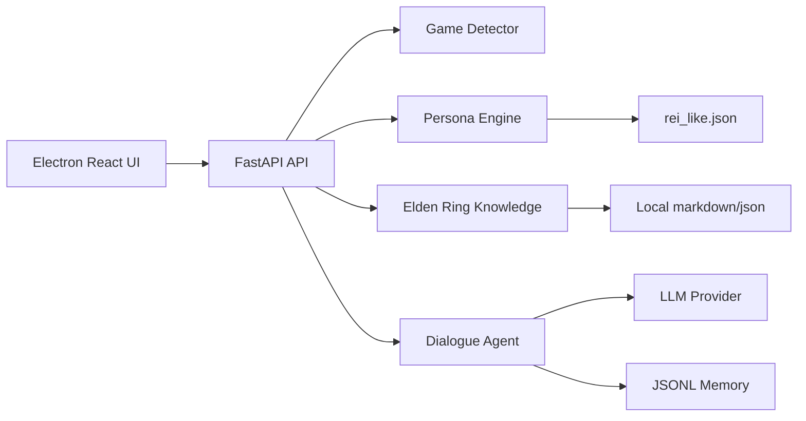

# Architecture

## Backend Modules

- `game_detector`: process detection with Windows priority.
- `persona_engine`: persona JSON loading and system prompt construction.
- `elden_ring_knowledge`: keyword search over local knowledge files.
- `dialogue_agent`: orchestration and provider abstraction.
- `memory`: JSONL session storage.
- `voice_engine`: mock STT/TTS API placeholder.

## Extension Points

- Replace keyword search with vector RAG behind the same `search(query)` API.
- Add game registry and per-game detector classes.
- Add persona registry and UI selection.
- Add real STT/TTS providers behind voice abstractions.
- Add Live2D or overlay rendering in the Electron shell.

